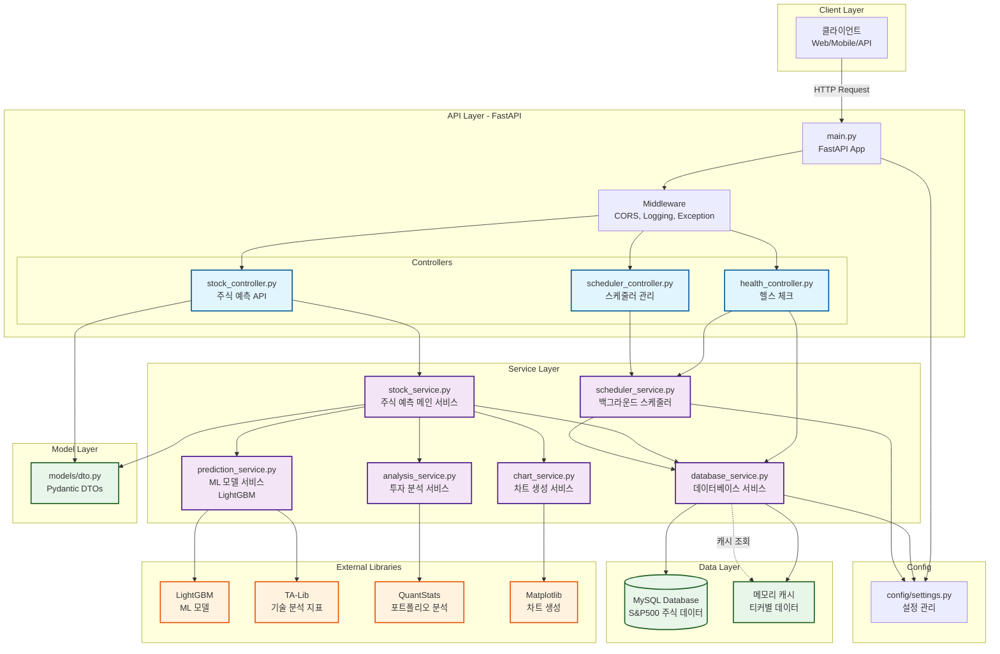
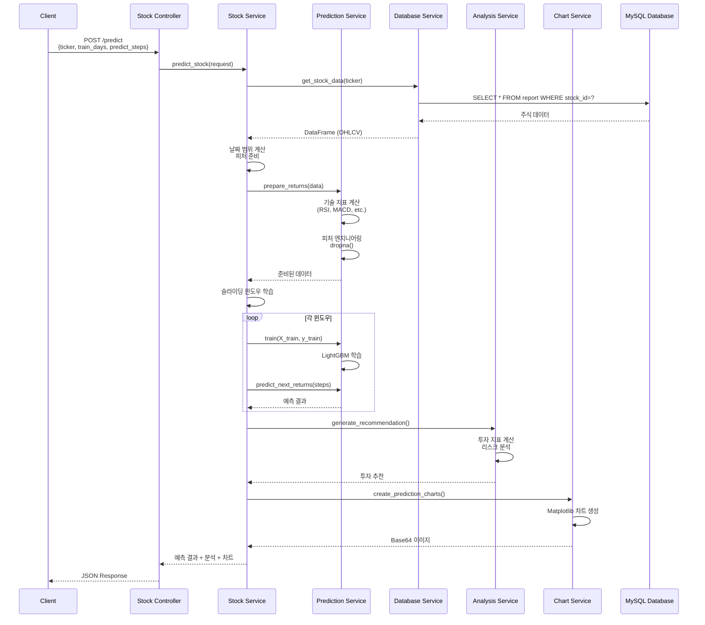
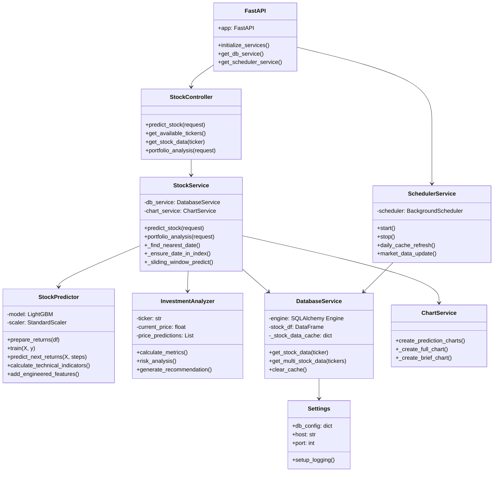
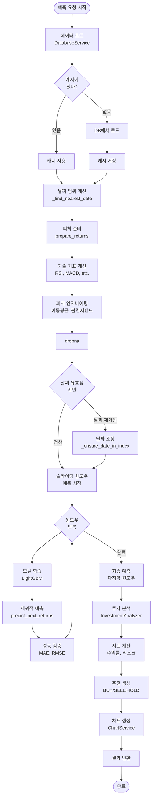
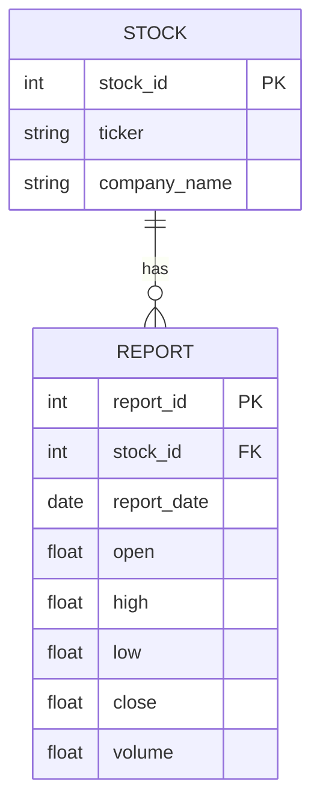
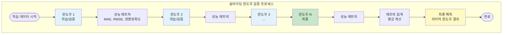
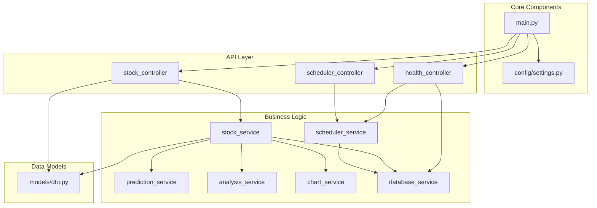

# StockSimulator-Data 프로젝트 아키텍처

## 📐 시스템 아키텍처 다이어그램



## 🔄 데이터 흐름도



## 🏗️ 클래스 관계도



## 📊 예측 프로세스 플로우차트



## 🔌 API 엔드포인트 구조

```mermaid
graph LR
    subgraph "API Endpoints"
        A[POST /predict<br/>주식 예측]
        B[GET /tickers<br/>티커 목록]
        C[GET /data/{ticker}<br/>주식 데이터]
        D[POST /portfolio/analysis<br/>포트폴리오 분석]
        E[GET /health<br/>헬스 체크]
        F[GET /scheduler/status<br/>스케줄러 상태]
    end
    
    subgraph "Services"
        S1[StockService]
        S2[DatabaseService]
        S3[SchedulerService]
    end
    
    A --> S1
    B --> S2
    C --> S2
    D --> S1
    E --> S2
    E --> S3
    F --> S3
```

## 🗄️ 데이터베이스 스키마



## 🔄 피드백 루프 (슬라이딩 윈도우 검증)



## 📦 컴포넌트 의존성



---

## 📝 다이어그램 설명

### 1. 시스템 아키텍처 다이어그램
- 전체 시스템의 계층 구조와 컴포넌트 간 관계를 보여줍니다
- 클라이언트부터 데이터베이스까지의 전체 흐름을 시각화합니다

### 2. 데이터 흐름도
- 예측 요청이 들어와서 결과가 반환될 때까지의 시퀀스를 보여줍니다
- 각 서비스 간의 상호작용을 시간 순서대로 표현합니다

### 3. 클래스 관계도
- 주요 클래스와 그들의 메서드, 속성을 보여줍니다
- 클래스 간 의존성을 명확히 합니다

### 4. 예측 프로세스 플로우차트
- 예측 프로세스의 단계별 흐름을 보여줍니다
- 조건부 분기와 반복 프로세스를 포함합니다

### 5. API 엔드포인트 구조
- 모든 API 엔드포인트와 연결된 서비스를 보여줍니다

### 6. 데이터베이스 스키마
- 데이터베이스 테이블과 관계를 보여줍니다

### 7. 피드백 루프
- 슬라이딩 윈도우 검증 프로세스를 보여줍니다

### 8. 컴포넌트 의존성
- 컴포넌트 간 의존성 관계를 보여줍니다
